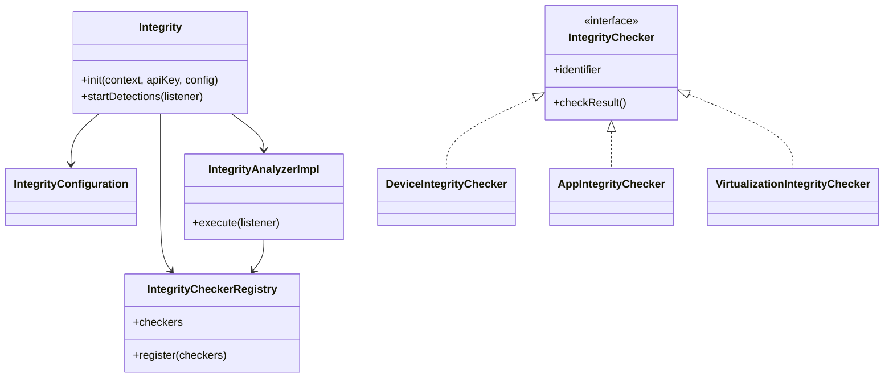
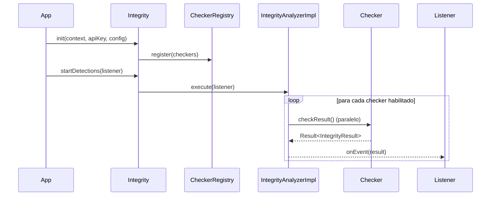
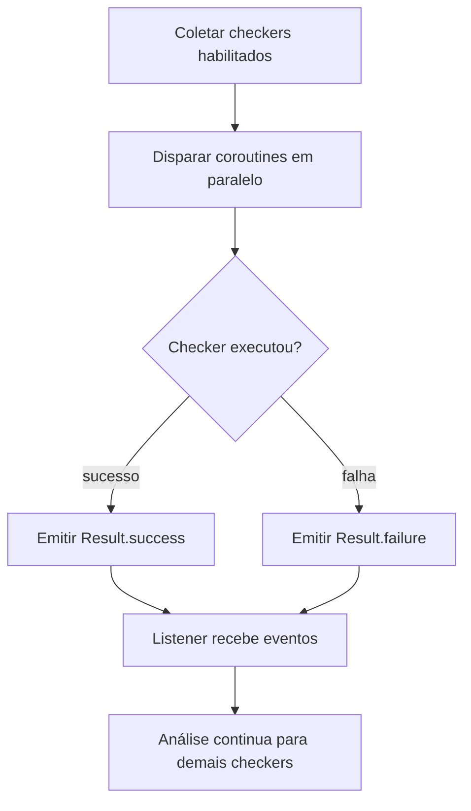

# Android Integrity SDK — Apresentação Técnica

## 1. Objetivo da solução
Detectar sinais de comprometimento no ambiente Android para apoiar decisões de risco no app/backend.

**Escopo implementado:**
- Root detection
- Emulator detection
- Virtualization / cloning detection
- Developer settings (ADB, modo desenvolvedor, package verifier)
- App integrity (package name e assinatura)

---

## 2. Problema e abordagem
**Problema:** apps sensíveis sofrem abuso em dispositivos comprometidos, ambientes virtualizados e apps adulterados.

**Abordagem escolhida:**
- Defesa em profundidade (múltiplos sinais)
- Arquitetura modular por checkers
- Execução assíncrona/paralela
- API simples de integração

> Ponto importante: o SDK não é “bala de prata”; ele gera sinais para decisão de risco.

---

## 3. Arquitetura (visão geral)

**Decisão-chave:** separar por domínios para facilitar manutenção e evolução sem quebrar API pública.

---

## 4. Fluxo de execução (runtime)

**Motivação técnica:** reduzir latência total e não travar análise caso um checker falhe.

---

## 5. Módulos e decisões principais

### 5.1 Device Integrity
- **Root**: heurísticas em Kotlin + validações nativas (C/JNI)
- **Emulator**: sinais típicos de emulação
- **Developer settings**: ADB, developer mode, package verifier

**Por quê?** aumentar robustez e custo de bypass trivial.

### 5.2 App Integrity
- Validação de **package name** esperado
- Validação de **assinatura (SHA-256)**

**Por quê?** reduzir risco de repackaging/distribuição adulterada.

### 5.3 Virtualization
- Apps conhecidos de virtualização/clonagem
- Diretórios de instalação suspeitos
- Bibliotecas virtuais em memória

**Por quê?** ambientes virtualizados são vetores comuns para fraude/automação.

---

## 6. Concorrência e confiabilidade

- Uso de `Dispatchers.IO` para I/O/checagens.
- Uso de `SupervisorJob` para isolar falhas.
- Entrega assíncrona por evento.

---

## 7. Trade-offs assumidos
- Heurísticas exigem atualização contínua
- Possibilidade de falso positivo
- Código nativo aumenta manutenção

**Mitigações propostas:**
- Ajuste contínuo de regras
- Estratégia por score/risco (não bloqueio cego)
- Telemetria para calibração

---

## 8. Evolução recomendada (roadmap)
1. Risk score unificado por sessão/usuário
2. Remote config para ativar/desativar checkers
3. Integração com Play Integrity API
4. Dashboards de telemetria e tuning de regras

---

## 9. Perguntas esperadas (respostas objetivas)

**“É bypassável?”**
Sim, como qualquer controle client-side avançado. O objetivo é elevar custo de ataque e melhorar detecção.

**“Por que não usar só Play Integrity?”**
Porque sinais locais complementam cobertura e tempo de resposta; o ideal é combinação.

**“Como evitar falso positivo?”**
Com score de risco, telemetria e políticas graduais (monitorar → desafiar → bloquear).

---

## 10. Encerramento
- O SDK entrega base sólida e extensível para mobile security.
- A decisão final deve ser contextual, combinando app + backend + negócio.
- Próximo passo: evoluir para motor de risco orientado por dados.
