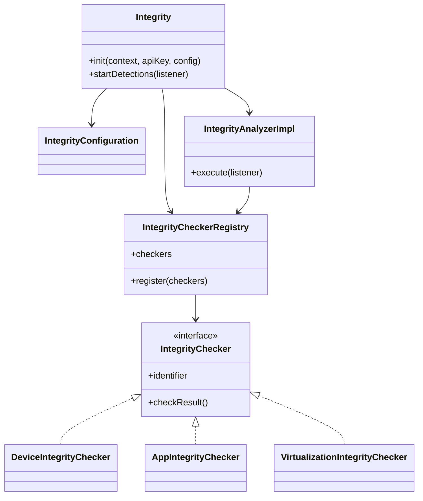
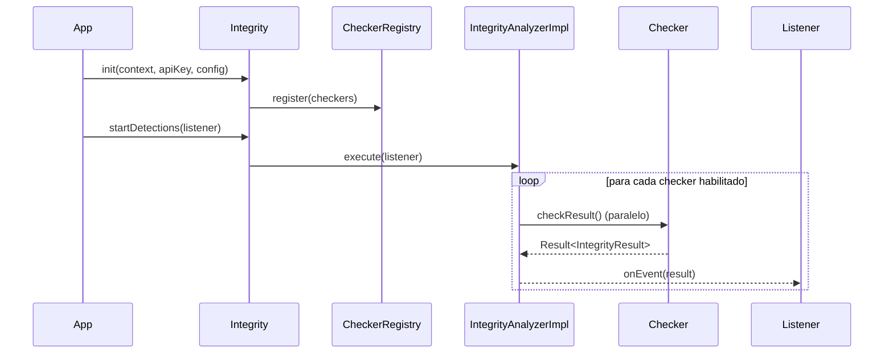
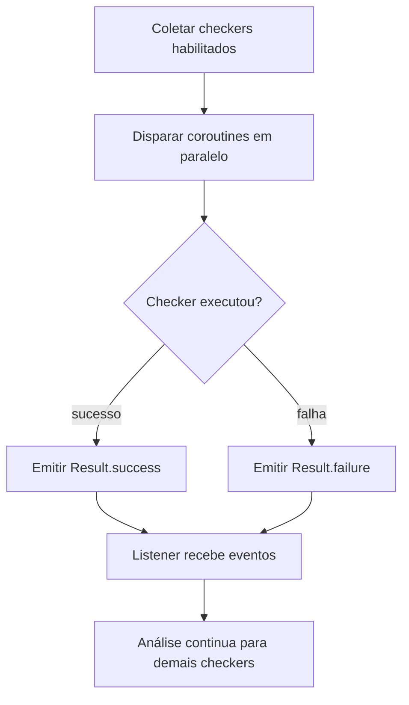

# Android Integrity

## 1. Objetivo
Criação de um detetor de sinais de anomalias ou comprometimento no ambiente Android.

**Escopo implementado:**
Para realizar as detecções, foram criados as seguintes verificações:

- Root detection
- Emulator detection
- Virtualization / cloning detection
- Developer settings (ADB, modo desenvolvedor, package verifier)
- App integrity (package name e assinatura)
---
## 2. Arquitetura (visão geral)

**Decisão-chave:** separar por domínios para facilitar manutenção e evolução

---

## 4. Fluxo de execução (runtime)

**Motivação técnica:** reduzir latência total e não travar análise caso um checker falhe.

---

## 5. Módulos e decisões principais

### 5.1 Device Integrity
- **Root**: heurísticas em Kotlin + validações nativas (C/JNI)
- **Emulator**: sinais típicos de emulação
- **Developer settings**: ADB, developer mode, package verifier

### 5.2 App Integrity
- Validação de **package name** esperado
- Validação de **assinatura (SHA-256)**

### 5.3 Virtualization
- Apps conhecidos de virtualização/clonagem
- Diretórios de instalação suspeitos
- Bibliotecas virtuais em memória

---

## 6. Concorrência na execução das validações

- Uso de `Dispatchers.IO` para I/O/checagens.
- Uso de `SupervisorJob` para isolar falhas.
- Entrega assíncrona por evento.

---

## 7. Ríscos assumidos
- Heurísticas exigem atualização contínua
- Possibilidade de falso positivo
- Código nativo necessidade de uma manutenção específica
---

## 8. Tecnologias utilizadas
- **Kotlin**: linguagem principal do SDK e implementação dos checkers.
- **Coroutines (`kotlinx.coroutines`)**: execução assíncrona e paralela das verificações.
- **`Dispatchers.IO` + `SupervisorJob`**: concorrência com isolamento de falhas entre checkers.
- **C/JNI (NDK)**: validações nativas para cenários sensíveis (ex.: root/virtualização).
- **Gradle Kotlin DSL**: build, empacotamento da lib e integração no app consumidor.

**Motivação de stack:** combinar produtividade (Kotlin) com robustez adicional em pontos críticos (C/JNI), mantendo integração simples para times Android.

---

## 8. Evolução possíveis
1. Risk score unificado por sessão/usuário
2. Remote config para ativar/desativar checkers
3. Integração com Play Integrity API
4. Dashboards de telemetria e tuning de regras
5. Adiocinar o conceito de score/risco dinâmico para cada tipo de detecção
---

## 9. Perguntas esperadas

**“É possível burlar as validações?”**
Sim, o objetivo é elevar custo de ataque e melhorar detecção.

**“Como evitar falso positivo?”**
Adicoinar uma telemetria dos eventos de deteções.
---

