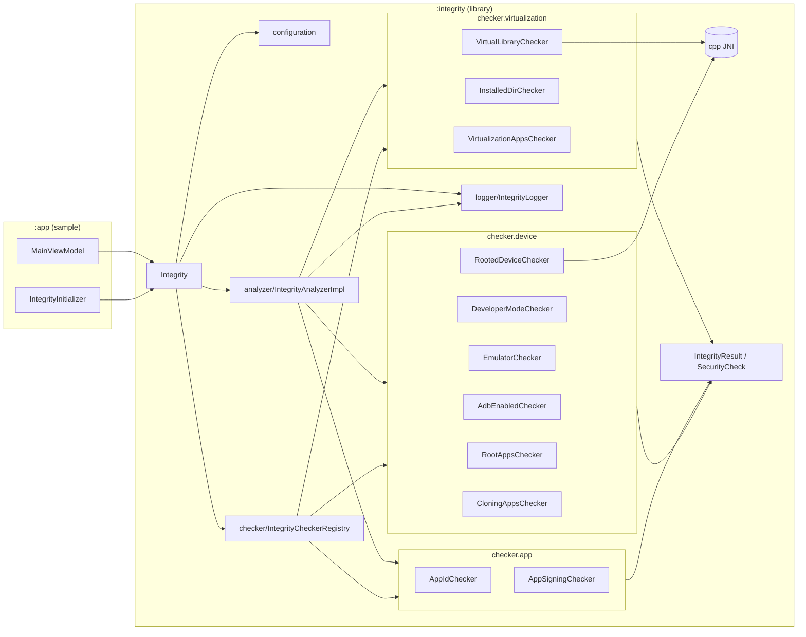

# Integrity Android Library

Biblioteca Android para **análise de integridade do ambiente de execução**. O objetivo do projeto é oferecer uma API simples para detectar sinais de risco, como root, emulador, virtualização, configurações de desenvolvedor inseguras e adulteração da assinatura/pacote do app.

## Visão geral do projeto

Este repositório possui dois módulos:

- `:integrity` → biblioteca principal, com o motor de detecção.
- `:app` → aplicativo de exemplo para demonstrar inicialização e consumo dos resultados.

A entrada da biblioteca é feita por `Integrity.instance`, que:

1. recebe `Context` + configuração;
2. monta um registro de checkers por domínio (device/app/virtualization);
3. executa as validações em paralelo;
4. retorna eventos assíncronos com `IntegrityResult`.

## Principais funcionalidades

- **Integridade do dispositivo**: root (incluindo JNI), apps de root, emulador, apps de clonagem, ADB e modo desenvolvedor.
- **Integridade de aplicação**: validação de `appId` e assinatura esperada.
- **Integridade de virtualização**: apps conhecidos, diretório de instalação e bibliotecas virtuais em memória.
- **Execução assíncrona**: validações paralelas via coroutines.
- **Observabilidade**: logging centralizado por `IntegrityLogger`.

## Escolhas de arquitetura

### 1) Orquestração central + checkers especializados

A classe `Integrity` atua como fachada da biblioteca. Ela concentra inicialização e acionamento, mas delega as regras para checkers pequenos e focados.

- `Integrity` cria um `IntegrityCheckerRegistry`.
- O registry agrega checkers por pacote funcional:
  - `checker.app`
  - `checker.device`
  - `checker.virtualization`
- `IntegrityAnalyzerImpl` executa todos os checkers habilitados em paralelo.

**Benefício**: baixo acoplamento entre regras; fácil extensão com novos checkers.

### 2) Contratos simples e coesos

- `IntegrityChecker` define contrato único (`identifier` + `check()`), e padroniza saída com `checkResult()`.
- Resultado de domínio é unificado em `IntegrityResult` + `SecurityCheck` (`Secure`, `Flagged`, `Error`).

**Benefício**: fluxo previsível e estável para quem consome a API.

### 3) Separação por domínio de risco

As detecções são agrupadas por contexto de segurança:

- **AppIntegrityChecker**
- **DeviceIntegrityChecker**
- **VirtualizationIntegrityChecker**

**Benefício**: legibilidade arquitetural e evolução independente por domínio.

### 4) Estratégia híbrida Kotlin + C/JNI

Para checagens sensíveis (ex.: root e virtualização), o projeto combina Kotlin com código nativo (`CMake` + C).

**Benefício**: eleva a robustez de detecção contra técnicas simples de bypass.

## Implementações de Clean Code no projeto

- **Single Responsibility (SRP)**: cada checker trata uma regra específica (ex.: `AdbEnabledChecker`, `RootAppsChecker`, `VirtualLibraryChecker`).
- **Nomes explícitos**: tipos e classes descrevem intenção (`IntegrityAnalyzer`, `IntegrityCheckerRegistry`, `ValidationType`).
- **Contratos antes de implementação**: interfaces para analyzer/checkers favorecem substituição e testes.
- **Modelagem de resultado expressiva**: `sealed interface SecurityCheck` evita estados ambíguos.
- **Builder para configuração**: `IntegrityConfigurationBuilder` centraliza parâmetros e evita construtores complexos.
- **Organização por pacotes de domínio**: reduz “classes utilitárias gigantes” e aumenta navegabilidade.

## Diagrama de pacotes e comunicação entre módulos



## Como usar

### Dependência

```kotlin
dependencies {
    implementation(project(":integrity"))
}
```

### Inicialização

```kotlin
Integrity.instance.init(context, "api-key") {
    logEnabled = true
    appId = "dev.givaldo.app_protected"
}
```

### Execução das detecções

```kotlin
Integrity.instance.startDetections { result ->
    result.onSuccess { integrity ->
        when (val status = integrity.result) {
            is SecurityCheck.Secure -> Unit
            is SecurityCheck.Flagged -> Unit
            is SecurityCheck.Error -> Unit
        }
    }
}
```

## Validações disponíveis

- `AppSignature`
- `AppPackageName`
- `DeveloperModeEnabled`
- `Emulator`
- `CloningAppsInstalled`
- `Root`
- `RootAppsInstalled`
- `AdbEnabled`
- `PackageVerifierDisabled`
- `VirtualizationInstalledApps`
- `InstallationDir`
- `VirtualLibraryPresent`

## Stack

- Kotlin
- Coroutines
- AndroidX Startup
- JNI/C (CMake)
- Gradle Kotlin DSL
