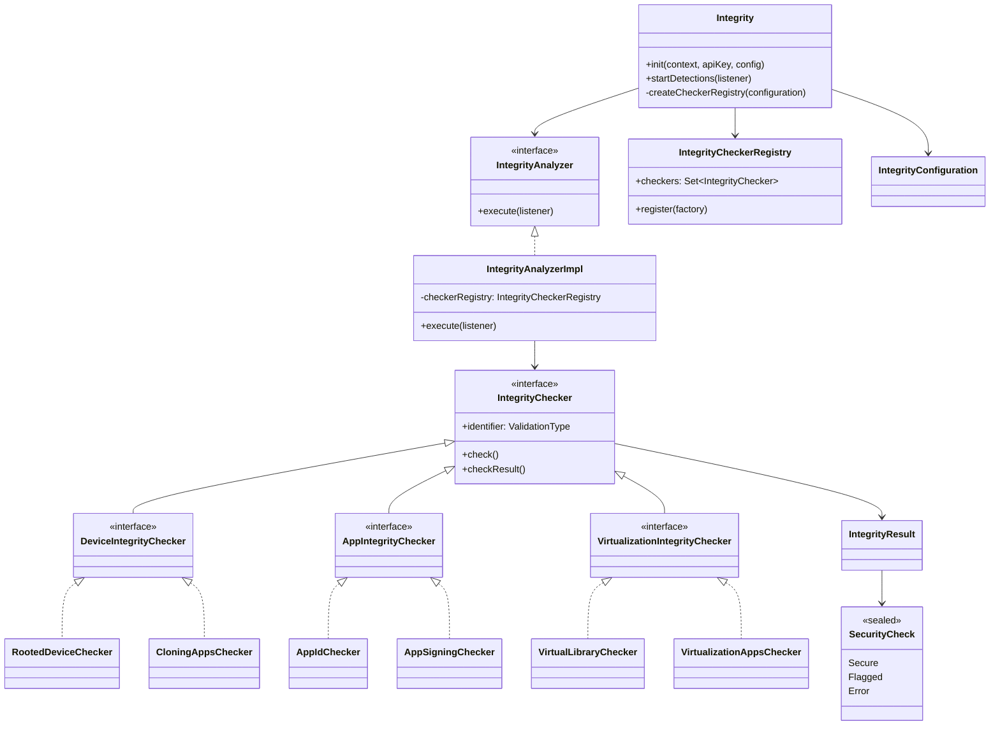

# Integrity Android Library

Biblioteca Android para **análise de integridade do ambiente de execução**. O objetivo do projeto é oferecer uma API simples para detectar sinais de risco, como root, emulador, virtualização, configurações de desenvolvedor inseguras e adulteração da assinatura/pacote do app.

## Tecnologias utilizadas

- Kotlin
- Coroutines
- JNI/C (CMake)
- Gradle Kotlin DSL

## Visão geral do projeto

Este repositório possui dois módulos:

- `:integrity` → biblioteca principal, com o motor de detecção.
- `:app` → aplicativo de exemplo para demonstrar inicialização e consumo dos resultados.

A instância da biblioteca é acessada por `Integrity.instance`, que:

1. recebe um `Context` e a configuração inicial;
2. monta um registro de checkers por domínio (device/app/virtualization);
3. executa as validações em paralelo;
4. retorna eventos assíncronos com `IntegrityResult`.

## Principais funcionalidades

- **Integridade do dispositivo**: root, apps de root, emulador, apps de clonagem, ADB e modo desenvolvedor.
- **Integridade de aplicação**: validação de `appId` e assinatura do aplicativo.
- **Integridade de virtualização**: apps conhecidos, diretório de instalação e bibliotecas virtuais em memória.
- **Execução assíncrona**: validações paralelas via coroutines.

## Escolhas de arquitetura

### 1) Orquestração central + checkers especializados

A classe `Integrity` atua como fachada da biblioteca. Ela concentra inicialização e acionamento, e delega as regras para checkers.

- `Integrity` cria um `IntegrityCheckerRegistry`.
- O registry agrega checkers:
  - `checker.app`
  - `checker.device`
  - `checker.virtualization`
- `IntegrityAnalyzerImpl` executa todos os checkers habilitados em paralelo.

### 2) Contratos simples

- `IntegrityChecker` define contrato único (`identifier` + `check()`), e padroniza saída com `checkResult()`.
- Resultado de domínio é unificado em `IntegrityResult` + `SecurityCheck` (`Secure`, `Flagged`, `Error`).

### 3) Separação por domínio de risco

As detecções são agrupadas por contexto de segurança:

- **AppIntegrityChecker**
- **DeviceIntegrityChecker**
- **VirtualizationIntegrityChecker**

### 4) Estratégia híbrida Kotlin + C/JNI

Para checagens sensíveis (ex.: root e virtualização), o projeto combina Kotlin com código nativo (`CMake` + C), bom objetivo de elevar a robustez de detecção contra técnicas simples de bypass.

## Padrões utilizados no projeto

- **Single Responsibility (SRP)**: cada checker trata uma regra específica (ex.: `AdbEnabledChecker`, `RootAppsChecker`, `VirtualLibraryChecker`).
- **Nomes explícitos**: tipos e classes descrevem intenção (`IntegrityAnalyzer`, `IntegrityCheckerRegistry`, `ValidationType`).
- **Contratos antes de implementação**: interfaces para analyzer/checkers favorecem substituição e testes.
- **Modelagem de resultado expressiva**: `sealed interface SecurityCheck` evita estados ambíguos.
- 
- ## Estrutura do Projeto
O projeto segue uma organização baseada em **Domínios**, estruturada da seguinte forma:

* **Navegabilidade:** Localização rápida de arquivos relacionados a uma regra de negócio específica.
* **Escalabilidade:** Facilidade para adicionar novos módulos sem afetar os existentes.
* **Isolamento:** Cada pacote de domínio contém sua própria lógica, facilitando a manutenção.

## Diagrama de classes



## Como usar

### Dependência
Declarar a dependência no `build.gradle.kts` do aplicativo:

```kotlin
dependencies {
    implementation(project(":integrity"))
}
```

### Inicialização
Realizar a inicialização na Application, ou utilizar o [Android Initializer](https://developer.android.com/reference/androidx/startup/Initializer):

```kotlin
Integrity.instance.init(context, "api-key") {
    logEnabled = true
    appId = "dev.givaldo.app_protected"
}
```

### Execução das detecções
Iniciar a detecteção de integridade:

```kotlin
Integrity.instance.startDetections { result ->
    result.onSuccess { integrity ->
        when (val status = integrity.result) {
            is SecurityCheck.Secure -> Unit
            is SecurityCheck.Flagged -> Unit
            is SecurityCheck.Error -> Unit
        }
    }
}
```

## Validações disponíveis

Lista **completa** dos tipos de validação atuais (`ValidationType`):

| ValidationType | Descrição |
| --- | --- |
| `AppSignature` | Verifica se a assinatura do app corresponde à assinatura esperada na configuração. |
| `AppPackageName` | Valida se o package name instalado é o mesmo que o `appId` esperado. |
| `DeveloperModeEnabled` | Identifica se o modo desenvolvedor está ativo no dispositivo. |
| `Emulator` | Detecta execução em emulador Android. |
| `CloningAppsInstalled` | Procura apps conhecidos de clonagem/dual apps instalados no dispositivo. |
| `Root` | Detecta sinais de root por múltiplas estratégias (incluindo verificação nativa). |
| `RootAppsInstalled` | Detecta presença de apps conhecidos de gerenciamento/root. |
| `AdbEnabled` | Verifica se Android Debug Bridge (ADB) está habilitado. |
| `PackageVerifierDisabled` | Indica se a verificação de pacotes/fontes foi desativada. |
| `VirtualizationInstalledApps` | Detecta apps conhecidos de virtualização de ambiente. |
| `InstallationDir` | Valida se o diretório de instalação do app é legítimo/esperado. |
| `VirtualLibraryPresent` | Detecta bibliotecas associadas à virtualização/hooking no processo. |
